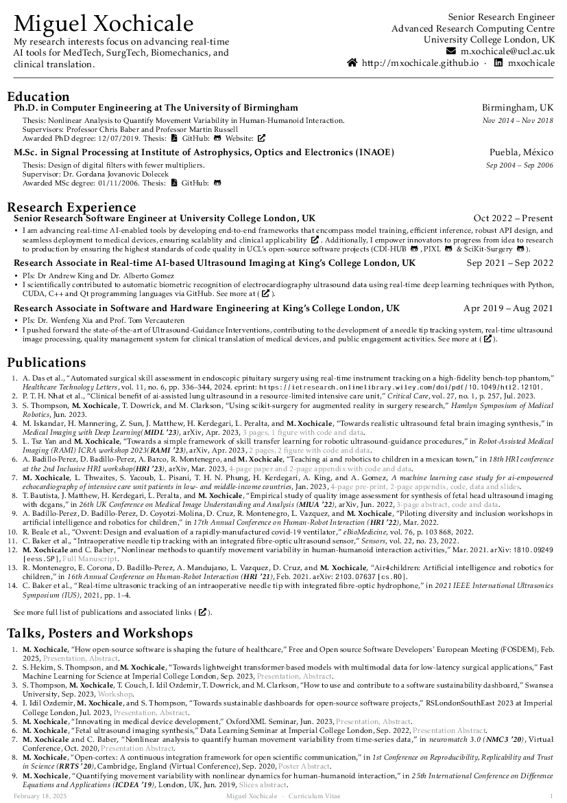
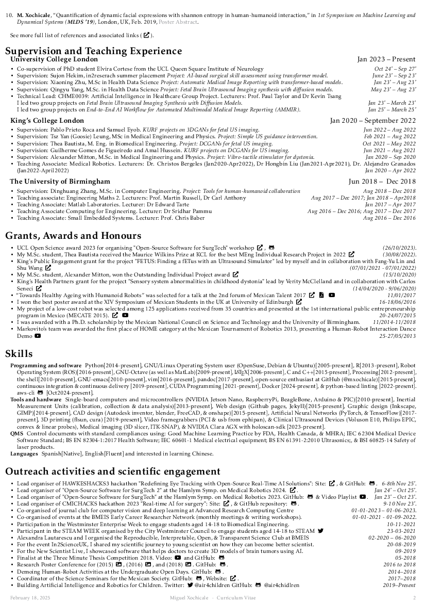

# :scroll: My Curriculum Vitae (June 2025)

[](https://github.com/mxochicale/cv/actions) [](https://github.com/mxochicale/cv/blob/generated-pdfs/cv-two-pages.pdf)

My Curriculum Vitae (CV) is written in LaTeX and it is built locally in Ubuntu 22.04x64 OS with [texlive](https://github.com/mxochicale/latex/tree/master/installation) and remotely with [github action CI](https://github.com/free-cortex/framework/tree/main/workflow). 
Refer to [README](tex/README.md) for detailed instructions on local and remote latex build.

## My CV
Download my latest CV by clicking on the following pages.

[](https://github.com/mxochicale/cv/blob/generated-pdfs/cv-two-pages.pdf)
[](https://github.com/mxochicale/cv/blob/generated-pdfs/cv-two-pages.pdf)


## Build CV locally
Open a terminal to build cv locally
```bash
cd $HOME/repositories/mxochicale/cv/tex
bash localbuilt.sh TwoPages 
make clean #clean project
```
For further details see [here](tex)

## Commit and push changes
```bash
git add .
git commit -m ':tada: version monthYEAR is ready CICV2P #0'
git push origin <FEATURE_BRANCH>
```

## Clone repository
After generating your SSH keys as suggested [here](https://docs.github.com/en/github/authenticating-to-github/generating-a-new-ssh-key-and-adding-it-to-the-ssh-agent) or [here](https://github.com/mxochicale/tools/blob/main/github/SSH.md).
You can then clone the repository by typing (or copying) the following line in a terminal at your selected path in your machine:
```
mkdir -p $HOME/repositories/mxochicale && cd $HOME/repositories/mxochicale
git clone git@github.com:mxochicale/cv.git
``` 

## Licence and Citation
This CV template is under Creative Commons Attribution-Share Alike license [](https://creativecommons.org/licenses/by-sa/4.0/). 
Hence, you are free to reuse it and modify it as much as you want and as long as you cite [my CV](https://github.com/mxochicale/cv) as the original reference and you re-share your CV, or similar work, under the same terms.

**NOTE** All the personal data under the path ([tex/](tex/)) is owned by Miguel Xochicale. All rights reserved.

## References
* [Severin Lemaignan's CV](https://github.com/severin-lemaignan/cv)  
* [Olivia Guest's CV](https://github.com/oliviaguest/cv) with its [overleaf version](https://v2.overleaf.com/read/zfwnyxkkdzxr)
* [Awesome-CV](https://github.com/posquit0/Awesome-CV) 
* [Jan Hendrik Metzen's CV](https://github.com/jmetzen/jmetzen.github.com/tree/master/)
* [Baptiste Auguié' Resume](http://baptiste.github.io/resume/)
* [Cheng Xu's CV](https://github.com/xu-cheng/cv)
* [How to write a LaTeX class file and design your own CV](https://www.overleaf.com/learn/latex/How_to_write_a_LaTeX_class_file_and_design_your_own_CV_(Part_1))

## Contact and issue report
Happy to touch base, just drop me an [e-mail](mailto:perez.xochicale@gmail.com?subject="[cv]").
If you have questions or issues relavant to this repo, please instead [open an issue](https://github.com/mxochicale/cv/issues).
